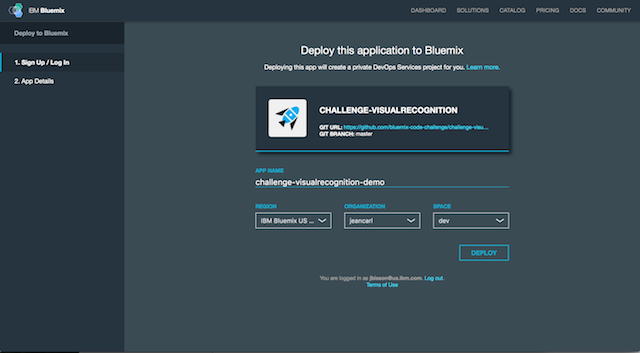
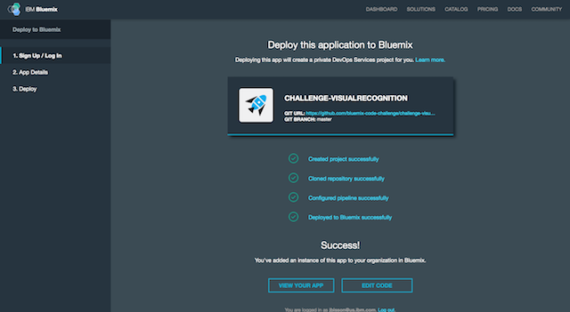
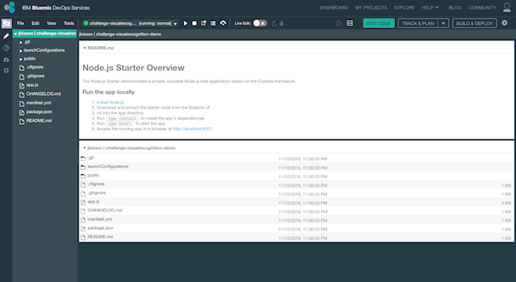
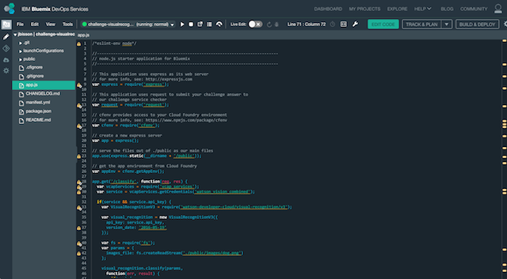
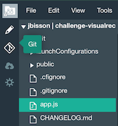
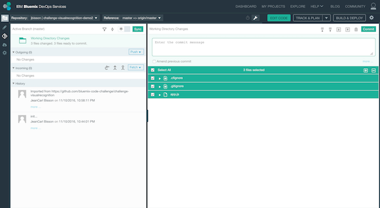
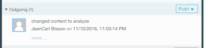
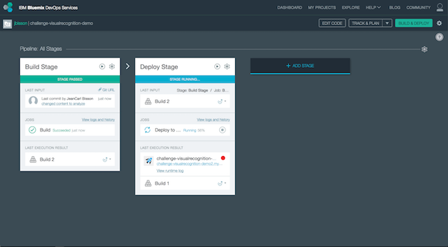
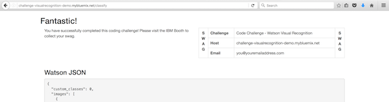

# Code Challenge: Visual Recognition

This challenge shows you how to deploy a Bluemix application, use IBM Bluemix DevOps Services, and use the IBM Watson Visual Recognition service in Node.js.
####
In this challenge you will work with a Node.js visual recognition application hosted on the [IBM Bluemix DevOps Services] (https://hub.jazz.net) cloud and using the [Watson Visual Recognition](https://www.ibm.com/watson/developercloud/visual-recognition.html) service in the [IBM Bluemix cloud](https://bluemix.net/). 

You can test the [Watson Translator Service demo](https://visual-recognition-demo.mybluemix.net/), study up on the [Watson Visual Recognition API Reference] (https://www.ibm.com/watson/developercloud/visual-recognition/api/v3/) and read the [Watson Visual Recognition Documentation.(https://www.ibm.com/watson/developercloud/doc/visual-recognition/) 


## Running the app on Bluemix

1. [](./img/createaccount.png)
Creating a Bluemix is easy. For a detailed desription, [check this YouTube video](https://www.youtube.com/watch?v=kUPwdfL8_oU&t=23s) 

2. Deploy the challenge application

 [](https://bluemix.net/deploy?repository=https://github.com/bluemix-code-challenge/challenge-visualrecognition.git)

3. Enter an application name. The host you choose will determinate the subdomain of your application's URL: `<host>.mybluemix.net`.

  [](./img/deploy.png)

4. Wait for the deployment to complete. Click on Edit Code.

  [](./img/deploymentsummary.png)

5. The IBM Bluemix DevOps Services tools allow you to edit code in the browser, configure a pipeline of processes to execute when new code is committed, and deploy applications automatically to IBM Bluemix.

  Select `app.js` to edit the application source code.

  [](./img/devops.png)

6. In this challenge, we’ll classify an image.

  [](./img/editor.png)

7. Replace the image name `dog.png` on line 42 with the image name `car.png` as shown below.

  ```
  ...
  var params = {
    images_file: fs.createReadStream('./public/images/dog.png')
  };
  ...
  ```

  The change should look as shown below.

  ```
  ...
  var params = {
    images_file: fs.createReadStream('./public/images/car.png')
  };
  ...
  ```

8. Replace the value for the `email` property on line 52 with your email address.
  ```
  ...
    // Change only the email address.
    var submission = {
      email: 'you@youremailaddress.com',
      data: JSON.stringify(result),
  ...
  ```

9. Lastly, uncomment lines 65 – 67 so the application can be verified.

  ```
  ...  
  // Uncomment
  //request.post('https://svcctracker.mybluemix.net/check/challengevisualrecognition', {form: submission}, function(err, response, body) {
  //  res.send(body);
  //});
  ...
  ```

  The change should look as shown below.

  ```
  ...  
  // Uncomment
  request.post('https://svcctracker.mybluemix.net/check/challengevisualrecognition', {form: submission}, function(err, response, body) {
    res.send(body);
  });
  ...
  ```

10. Now that changes have been made, the following steps will commit the changes to the attached Git repo. Click on the Git icon on the left side.

  [](./img/giticon.png)

10. Enter a commit message. Click on Commit.

  [](./img/commit.png)

11. In the left column, click on Push in the Outgoing section. This will push the changes to the remote branch.

  [](./img/push.png)

12. You can see the progress of the application deployment by clicking on the Build & Deploy button in the top-right corner of the page.

  [](./img/pipeline.png)

13. When the application has finished deploying to your IBM Bluemix account, visit your application’s URL, appended with `/classify`.

  [](./img/result.png)

  If you see a Fantastic page, you've completed this challenge successfully. If the page doesn't return a message, or it says Uh Oh!, please check the previous steps.
